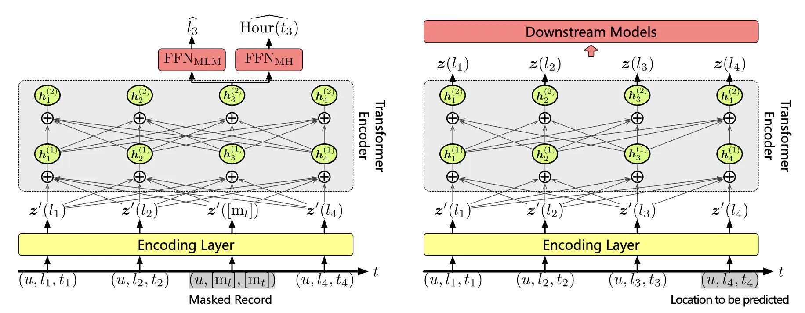

# CTLE: Context and Time-aware Location Embedding

This repository provides the implementation code for the **Context and Time-aware Location Embedding (CTLE)** model, as proposed in the AAAI 2021 paper *Pre-training Context and Time Aware Location Embeddings from Spatial-Temporal Trajectories for User Next Location Prediction*.

## Model Overview

CTLE is a pre-trained embedding model, which means it operate in two phases: (1) pre-training using the MLM and MH pretext tasks, and (2) adaptation to downstream tasks.

During the pre-training phase, CTLE is trained in a self-supervised manner, using a combination of the Masked Language Model (MLM) and the newly proposed Masked Hour (MH) tasks. These tasks aim to predict masked locations and masked hour indices, respectively.

In the downstream task adaptation phase, the contextual location embeddings generated by CTLE are fed into downstream predictors for specific tasks, such as next location prediction. Optionally, the parameters of CTLE can be further fine-tuned based on supervision from the downstream task.

## Repository Overview

This repository contains several different types of files.

`run.py` is the main entry point for the repository, which guides the model through the complete process of training and evaluation. `dataset.py` is a helper class used to preprocess raw trajectory datasets. `utils.py` includes utility functions that support various tasks.

The `embed` directory contains Python files that implement different location embedding methods, including CTLE and several baseline models. These baselines correspond to the methods discussed in the *Baseline Location Embedding Methods* section of the paper.

The `downstream` directory contains implementations of downstream task predictors. `loc_pre.py` includes predictors for location prediction, `traj_classify.py` handles trajectory classification, and `visit_time_pre.py` provides predictors for visit time prediction. Although the paper focuses on location prediction for evaluating embedding performance, the additional tasks are included here for potential utility.

The `datasets` directory contains example datasets. These datasets are mainly intended for quick testing and to demonstrate the expected file format.

## Paper Information

Reference:

> Yan Lin, Huaiyu Wan, Shengnan Guo, Youfang Lin. "Pre-training context and time aware location embeddings from spatial-temporal trajectories for user next location prediction." Proceedings of the AAAI Conference on Artificial Intelligence. Vol. 35. No. 5. 2021.

Paper: https://ojs.aaai.org/index.php/AAAI/article/view/16548

If you have any further questions, feel free to contact me directly. My contact information is available on my homepage: https://www.yanlincs.com/